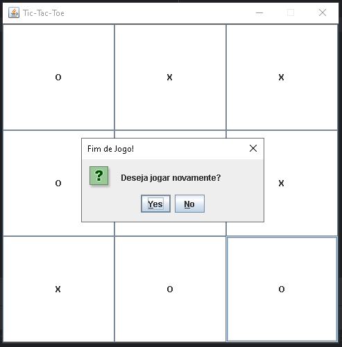

# ❌⭕ Tic-Tac-Toe Swing

<p align="center">
  
  
  
</p>

## 📖 Sobre o Projeto

Projeto desenvolvido com **Java Swing** para praticar conceitos de:

* Programação Orientada a Objetos (POO)
* Desenvolvimento de interfaces gráficas
* Manipulação de eventos
* Controle de estado da aplicação
* Organização de código em pacotes
* Lógica de jogos

O sistema permite que dois jogadores disputem uma partida de **Jogo da Velha (Tic-Tac-Toe)** em uma interface gráfica desktop.

---

## 🎮 Funcionalidades

✅ Interface gráfica construída com Java Swing

✅ Alternância automática entre os jogadores X e O

✅ Validação de jogadas

✅ Verificação de vitória

✅ Verificação de empate

✅ Exibição do vencedor através de JOptionPane

✅ Reinício da partida

✅ Bloqueio de jogadas após o término do jogo

---

## 🏗️ Estrutura do Projeto

```text
src
└── br.com.tictactoe
    ├── app
    │   └── Main.java
    ├── gui
    │   ├── GameFrame.java
    │   └── GamePanel.java
    ├── model
    │   ├── Board.java
    │   └── Player.java
    └── service
        └── GameService.java
```

> **Observação:** O projeto encontra-se em evolução. Atualmente parte da lógica do jogo ainda está concentrada na classe `GamePanel`. As classes `Board` e `GameService` foram criadas para futuras refatorações e melhorias na separação de responsabilidades.

---

## 🚀 Tecnologias Utilizadas

* Java
* Java Swing
* IntelliJ IDEA
* Git
* GitHub

---

## 📷 Interface
<p>Abaixo está uma captura de tela da aplicação em execução, demonstrando a interface gráfica desenvolvida com Java Swing e o sistema de reinicialização da partida.</p>

<p align="center">
  
</p>

---

## 🎯 Aprendizados

Durante o desenvolvimento deste projeto foram praticados conceitos como:

* Programação Orientada a Objetos (POO)
* Criação de interfaces gráficas com Swing
* Uso de JFrame, JPanel e JButton
* Tratamento de eventos com ActionListener
* Manipulação de arrays
* Controle de fluxo da aplicação
* Organização de código em pacotes
* Estruturação de projetos Java

---

## 🔮 Melhorias Futuras

* Separar a lógica do jogo para a camada de serviço
* Implementar a classe Board como representação do tabuleiro
* Melhorar a interface gráfica
* Adicionar ícone personalizado à janela
* Destacar visualmente o jogador vencedor
* Exibir o jogador da vez na interface
* Adicionar placar de partidas

---

## 👨‍💻 Autor

*desenvolvido com ☕ por [Daniel Avelino](https://github.com/D4nN3t0)*
